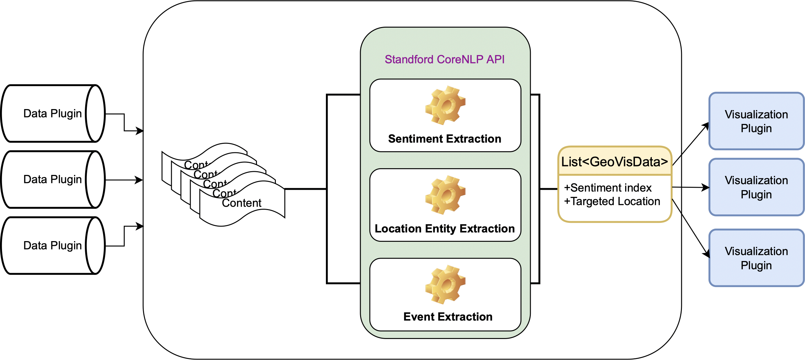

# Framework Design

## Domain

Domain: Describe your framework domain, with examples of possible plugins your framework could support. This could be about half a page, similar to the description in Appendix A.

Framework domain:

Our framework allows a user to visually represent three categories of data: text sentiment, location, and events. We envision this functionality will work best with a cartographic (world map) visualization of such data. Additionally visualization options will be provided in the event that locations are not found to be present within the provided text. All analysis and extraction of text is performed by the framework, aiding in reuse of provided functionality. We have chosen to use Stanford’s CoreNLP, as it is well-documented and free. 

Data plugins could provide to the framework a stream of tweets, news articles, or youtube comments. We intend to use the Twitter4j plugin and the News API to provide our data. But the scope of plugins are not limited to those. Other possible data plugins could be: 

- Reddit API
- Youtube API
- Sina Weibo API
- Douban API

The framework will provide text sentiment, location, and events to the data visualization plugins. We provide the following examples for ways to visualize this data:

1. Cartographic visualization: The framework displays a color-coded, political map of the world with red indicating bad sentiment and green indicating good sentiment. Events are displayed on the map based on what the user selects at runtime.
2. Horizontal bar graph: The framework displays a graph showing countries on the Y-axis, and percentage of text sentiment (good, bad) for each country as a bar over the X-axis.
3. Pie chart: The framework displays a pie chart of detected locations and their average text sentiment.

The visualization plugins viable include but are not limited to:

- Google charts 
- E-charts Java
- D3.js 

The reuse of our platforms are useful because different platforms have different makeup of users and the sentiment of them are all diverse. It would be interesting to see how in one platform, the sentiment towards a location changes over time. And it would also be interesting to reuse the framework on different data plugins to see how on different platforms the sentiment toward a location is different (some country are forbidden to go on to websites like twitter, so it would be useful to reuse the framework on such countries' own social voicing platforms). 

## Generality vs. Specificity

### Key abstractions

| Abstractions          | Description                                                  |
| --------------------- | ------------------------------------------------------------ |
| `GeoVisFrameWork`     | The interface for  the framework implementation.             |
| `GeoVisFrameWorkImpl` | The implementation for the framework.                        |
| `GeoData`             | This class have 2 attributes the sentiment index (`double`) and the targeted location (`String`), which is a representation of the data structure that we pass into the visualization plugins. |
| `GeoDataPlugin`       | The interface for data plugins for the framework.            |
| `GeoVisPlugin`        | The interface for visualization plugins for the framework.   |


### Reusable functionality

We provide our users with three reusable data processing categories: text sentiment analysis, location extraction, and event extraction. Our framework allows the user to reuse functionality that has been set up for making Twitter and News API calls. The NLP segments the input text, generates the text sentiment, extracts location data, and then extracts events. The text sentiment and location data extraction are done automatically, without control or input from the user. Event extraction is completed at runtime according to user specifications.

We note that providing “event” functionality may prove to be challenging given the limited time available for this assignment. As such, we deem it appropriate to narrow our scope, allowing for the possibility of implementing the “Events API” should time permit. Fine-grained event classification is filtered into high-level categories. Should this prove to be a successful endeavor, we will provide GUI checkbox functionality that allows a user to filter the events using the following options:

1. War: conflict, terrorism, civil unrest, and more.
2. Sports: any sort of sporting event that is detected, from cricket, to futbol, to running, and more.
3. Political: rallies, conferences, conventions, elections, and more.
4. Business: conferences, sales events, and more.
5. Academic: research conferences, conventions, and more.
6. Natural Disaster: tsunamis, tornadoes, hurricanes, earthquakes, and more.
7. Arts and Entertainment: festivals, concerts, shows, plays, and more.

Upon processing, this data is then stored and provided to data visualization plugins. In lieu of a successful “Events API,” we will provide a framework that provides for visual representation of text sentiment based on locations extracted from the data provided to our framework using NLP.

Upon successful extraction from the provided data plugins, our framework will then pass this information to our data visualization plugins (e.g. Google Charts API(JS):  geo charts, E-charts(JAVA)). Should the “Events API” be successful, it will be necessary to provide at least 3 variables to our data visualization plugins: textSentiment, locationCoordinates, and event. It may be necessary to add an additional field for each GeoData object dedicated to an assigned country or province, to allow for data visualization that is not based strictly on a cartographic representation of data. This will provide for additional data visualization plugin extensibility.

## Project Structure

**Project structure:** Describe your overall project structure: the organization of the framework and plugins into packages or projects, the location of plugin interfaces and key data structures, and how plugins are loaded. This will help us navigate your project later and will likely require less than half a page.

Our file structure are as follows

```
.
├── .gitignore
├── README.md
├── deliverables
│   ├── design.assets
│   │   └── diagram.png
│   ├── design.md
│   └── plan.md
├── pom.xml
└── src
    └── main
        └── java
            ├── core
            │   ├── dataplugin
            │   │   └── GeoDataPlugin.java
            │   ├── framework
            │   │   ├── Data.java
            │   │   ├── GeoData.java
            │   │   ├── GeoVisFramework.java
            │   │   └── GeoVisFrameworkImpl.java
            │   └── visualplugin
            │       └── GeoVisPlugin.java
            └── gui
                └── GeoVisState.java

```

Our project file structure is organized into three key components. These include:

1. src.main.java.core: this directory contains files related to data intake and NLP.
2. src.main.java.gui: this directory contains files related to data visualization and data vis plugins.
3. src.resources: this directory contains all of the relevant .jar files that must be installed as libraries in order for our framework to function.

The extracted information is stored in a data structure class called GeoData.java. We have created private fields and public getter and setter methods that are reusable. We expect the user will not need the ability to set the data, so these may be unnecessary if we use proper software design patterns to encapsulate the classes and information. We may need to make these fields package private, updating the access modifier from private to protected. As it stands, we provide the following data fields within GeoData.java:

1. text: a String variable that stores the text segment (a line, tweet, or sentence).
2. textSentiment: a String variable that stores the generated text sentiment from “text.”
3. location: a String variable that represents a location as identified by NLP that is extracted from “text.”
4. locationAddress: a String variable that represents a street address for “location.”
5. locationCoordinates: a 1-dimensional array that represents longitude and latitude coordinates for “location.”
6. event: a String variable that represents an event as identified by NLP that is extracted from “text.”

## Plugin Interfaces

Our system diagram is as follows. The data structure between the data plugin and the framework is represented by a list of contents (`List<String>`). The Framework will fetch a list of contents from the data plugins (e.g. news API, twitter API, reddit API), and do NLP analysis based on them. We are planning to use the Stanford CoreNLP API, an offline NLP library to extract 

1. sentiment in the content (represented as a positive/negative score as `double`)
2. location mentioned in the content, to a `String`
3. if time permits we would also try extract the event mentioned in the content

For location mentioned in the content, in that different people would call a place differently, and have a different scope when they refer to some place, we would further process the fuzzy location entity in Google's geo-encoder API to reformat the data, possibly to a country or state wide scope. 

After sentiment and location (and possible event) information is extracted from the list of contents, it will be packaged in to a list of `GeoData` which have 2 attributes the sentiment index (`double`) and the targeted location (`String`), the class is a representation of the data structure that we pass into the visualization plugins. 

Then the visualization plugin would take the sentiment index and map it onto the Location stored in the `GeoData`. And the visualization will be a cartographic map representing the sentiment towards different locations in the world. 




Below is the interface for the visualization plugins to adapt with our framework.

```java
package core;

import core.framework.GeoData;
import core.framework.GeoVisFramework;

import java.util.List;

/**
 * GeoVisPlugins will display data visually.
 * E.g. - Cartographic Map, Pie Chart, Bar Graph, Etc...
 * @param <P>
 */
public interface GeoVisPlugin<P> {

  /**
   * Displays the visualization of all data.
   */
  public void display();

  /**
   * Displays the visualization of text sentiment only.
   */
  public void displaySentimentOnly();

  /**
   * Displays the visualization of location only.
   */
  public void displayLocationOnly();

  /**
   * Displays the visualization of events only.
   */
  public void displayEventsOnly();

  /**
   * Set sentiment on location provided in the {@link List <GeoData>} list.
   * @param geoDataList a list of location to sentiment mapping
   */
  public void setSentimentOnLocation(List<GeoData> geoDataList);

  /**
   * Set events on location provided in the {@link List <GeoData>} list.
   * @param geoDataList a list of location to events mapping
   */
  public void setEventsOnLocation(List<GeoData> geoDataList);

  /**
   * Called (only once) when the plug-in is first registered with the
   * framework, giving the plug-in a chance to perform any initial set-up
   * before the data visualization has begun (if necessary).
   *
   * @param framework The {@link GeoVisFramework} instance with which the plug-in
   *                  was registered.
   */
  void onRegister(GeoVisFramework framework);

}
```
Below is our interface for the data plugins.

```java
package core;

import core.framework.GeoVisFramework;

import java.util.ArrayList;

/**
 * GeoDataPlugins will port data into the framework.
 * E.g. - Twitter API, News API, or CSV files...
 * @param <P>
 */
public interface GeoDataPlugin<P> {

  /**
   * Get num number of contents to be processed.
   * @param num the number of content (e.g. tweets, youtube comments, news stories) to fetch
   *            using the data plugin APIs
   * @return an array list of strings of texts
   */
  public ArrayList<String> getContent(int num);


  /**
   * Called (only once) when the plug-in is first registered with the
   * framework, giving the plug-in a chance to perform any initial set-up
   * before the data injection has begun (if necessary).
   *
   * @param framework The {@link GeoVisFramework} instance with which the plug-in
   *                  was registered.
   */
  void onRegister(GeoVisFramework framework);

}

```
